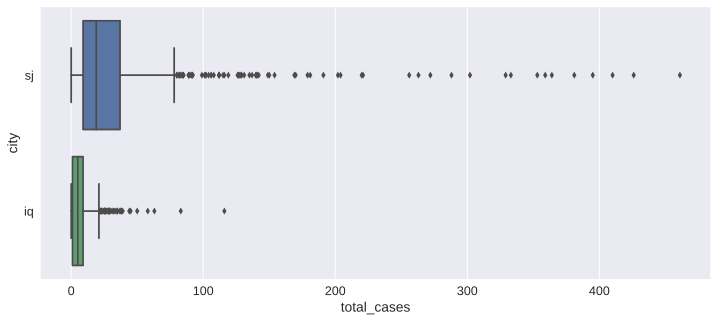

# Challenge of Dengue Fever Prediction competition

Akiyuki Ishikawa
May 05, 2017

## I. Definition

### 1. Project Overview
The challenge "DengAI: Predicting Disease Spread" competition is selected as my capstone project[^1]. This project's goal is to create the model that predicts the number of Dengue cases.

Preventing infectious diseases is a major challenge in order to keep our life healthy. Dengue fever is one of infectious diseases, which are most commonly transmitted to people through the bites of infected mosquitos[^1][^2][^3]. To predict spreading of the disease by using data is one of the challenging themes for us[^4][^5][^6].

Dengue disease occurs tropical and sub-tropical parts of the world. However, global warming effect may expand the area where the mosquitos can live and the influence spreads to the area where the people have not previously been harmed by this disease like Japan which is my country.

Knowing how predict the number of dengue cases, we can prepare and prevent proliferation of mosquitoes which serve as a medium for the diseases by spraying insecticide or removing water from locations where mosquito larvae live.

[^1]:www.drivendata.org/competitions/44/dengai-predicting-disease-spread/page/80/
[^2]:https://www.wikiwand.com/en/Dengue_fever
[^3]:https://www.cdc.gov/Dengue/
[^4]:https://www.ncbi.nlm.nih.gov/pmc/articles/PMC4816319/
[^5]:https://www.omicsonline.org/open-access/dengue-fever-prediction-a-data-mining-problem-2153-0602-1000181.php?aid=62375
[^6]:https://www.kaggle.com/c/predict-west-nile-virus


### 2. Problem Statement

In this project, I will construct my model to predict time series of the number of Dengue cases in weeks. The model consumes past or current environmental features and gives the prediction of the number of Dengue disease cases.

In addition to creating a model, I want to analyze the dataset to answer the following questions.

* How the environmental information affects the number of the dengue infection cases?
* Are there any characteristic variations depending on the cities?
* What is the most important feature to predict dengue cases?

#### Formulation
The problem is a regression problem in which we find a function $f(x)$ that provides predictions of target value $y(t) \in \mathcal{N}$ at time $t$ (the unit of time is week) based on given features $x(t) \in \mathcal{R}^{n}$. This can be expressed formally as a following equation with $k=1,2,3,\dots $
$$
  y(t) = f(x(t), x(t-1), \dots, x(t-k)).
$$

Here, we can use not only features at the same time as target, but also can use features at past times $t-k (k=1, 2, \dots)$. Note that we should not use features at future time, because that features are not available when we will apply the model to real problems.

### 3. Metrics

In this competition "Mean absolute error" is used[^7].
$$
\rm{MAE} = \frac{1}{T} \sum_{t=1}^{T} |\hat{y}(t) - y(t)|,
$$
where $\hat{y}(t)$ is prediction at $t$ and $y(t)$ is true value.

This simple metric is easy to understand and can be calculated efficiently. Comparing to other metrics such as RMSE (root mean square error):
$$
  \rm{RMSE} = \sqrt{\frac{1}{T}\sum (\hat{y}(t) - y(t))^2 },
$$
MAE is robust for outliers since this does not contains square term.
The following is an example which compares difference between MAE and RSME.

| t | y    | y_hat | y-y_hat | abs(y-y_hat) | (y-yhat)^2 |
|---|------|-------|---------|--------------|------------|
| 1 | 5    | 3.4   | 1.6     | 1.6          | 2.56       |
| 2 | 2    | 3.4   | -1.4    | 1.4          | 1.96       |
| 3 | 1000 | 3.4   | 996.6   | 996.6        | 993211.56  |
| 4 | 4    | 3.4   | 0.6     | 0.6          | 0.36       |
| 5 | 3    | 3.4   | -0.4    | 0.4          | 0.16       |

```
MAE = 200.12
RMSE = 445.69
```

[^7]:https://www.drivendata.org/competitions/44/dengai-predicting-disease-spread/page/82/#mae


## II. Analysis

### 1. Data Exploration

#### 1.1 Dataset description
The dataset is divided into training and test datasets by the date and cities (*San Juan*[^8] and *Iquitos*[^9]). The training dataset contains  target and feature values, while the test dataset have only feature value.
Since this is a time series prediction problem, measurement dates of training data are earlier than test data. Training and test dataset are summarized in the following table.

|city     | training data           | test data               |
|---------|-------------------------|-------------------------|
|San Juan | 1990-04-30 - 2008-04-22 | 2008-04-29 - 2013-04-23 |
|Iquitos  | 2000-07-01 - 2010-06-25 | 2010-07-02 - 2013-06-25 |

Table 1: Period of training and test data in each city

The target value is the number of weekly Dengue cases. The feature dataset consists of some environmental measurements such as "vegetation index (NDVI)", "temperature", "precipitation", "humidity" (The detail of descriptions of features is provided by the competition site[^10]). As well as target value, each feature is given by weekly frequency.
The task in this problem is to train models using the environmental features of training dataset and predict new target value by applying the models into features of test dataset (see Fig.1).


Figure 1: Schematic picture of target and features.


[^8]:https://www.wikiwand.com/en/San_Juan,_Puerto_Rico
[^9]:https://www.wikiwand.com/en/Iquitos
[^10]:https://www.drivendata.org/competitions/44/dengai-predicting-disease-spread/page/82/

#### 1.2 Exploratory Analysis

##### Time series

The Figure 2 depicts time series and the histogram of the target values. The upper plots show target values of *San Juan* while the lower plots show *Iquitos* . In both plots, we can observe some peaks. The peaks are considered the indication of epidemics of the Dengue fever.

While the epidemic peaks irregularly vary in a wide range (ie. From 400 to 50 cases and from 120 to 20 in *San Juan* and *Iquitos* respectively), some periodic small bump structures are also observed. This periodic structured can be thought as a result of seasonal effect, because the mosquito's activities are depend on the climatic conditions, which are characterized by temperature and humidity and so on.


Figure 2: Time series and histogram in each city. Upper is the time series of *San Juan*'s target values (left) and histogram of the target values over the time (right). Lower is *Iquitos*'s time series (left) and histogram (right).

Time series of other features are also shown in VI. Appendix. In the *San Juan*'s plot of other features, we can see that the periodic structures are clearer rather than the *Iquitos*'s plot. This can be thought as a result of the differences in the locations of the two cities. The *San Juan* locates in the small island which is surrounded by sea, while the *Iquitos* is located in the inland of 100m above sea level and under the equator. These differences should affect the climatic features.

##### Statistics of target values

Basic statistics of training data are shown in Table 2 and box plot of the data are also shown in Figure 3. *Iquitos* has obviously smaller value of total cases than *San Juan* has. The ratios of mean and median (`mean/median`) are 1.8 and 1.5 in *San Juan* and *Iquitos*, respectively. This discrepancy between mean and median is a result of the skewed distribution of total cases. In both cities, standard variations (`std`) have larger values than means of total cases.

| Stats of total case | San Juan  | Iquitos   |
|---------------------|-----------|-----------|
| weeks               | 936       | 520       |
| mean                | 34.180556 | 7.565385  |
| std                 | 51.381372 | 10.765478 |
| min                 | 0         | 0         |
| 25%                 | 9         | 1         |
| 50%                 | 19        | 5         |
| 75%                 | 37        | 9         |
| max                 | 461       | 116       |
Table 2: Basic statistics of total cases of training data.


Figure 3: Box plot of total cases.

##### Missing values

Dataset will have some missing values from various reasons. Figure 4 visualizes missing value's location where the black area indicates `NA` values. Each feature has some missing values and most missing values are isolated in term of time.


Figure 4: Visualization of missing values of all features ( *San Juan* (upper) and *Iquitos* (lower) ). Location of missing value is shown as black areas.

##### Monthly variations

In order to investigate the seasonal effect, averaged target values for each month are calculated and shown in Figure 5. Clear dependence on the month is observed. This observation suggests that the number of month can be used as a additional features.


Figure 5:Box plots of total cases for each months. In two cities, clear dependence on months can be observed.

##### Autocorrelation

Here, I calculate the autocorrelation function of some features. Autocorrelation indicates how a feature at a specific time affects the same feature at the different times. In a sense, this indicates how long time the feature memorize the previous value's effect. The definition of autocorrelation is given by the following equations,
$$
  \mu = E[{x(t)}], \\
  \sigma = E[\{x(t)-\mu\}^2], \\
  \gamma_{k} = E[{\{x(t)-\mu\}\{x(t-k)-\mu\}}], \\
  \rho_{k} = \frac{\gamma_k}{\sigma},
$$
where $x(t)$ is a feature's value at the time $t$. The mean $\mu$ is given by averaging the $x(t)$ over the total time. Since autocorrelation function is normalized by $\sigma$, $\rho_{k}$ is bounded in $(-1\le \rho_{k} \le 1, k=1, 2, \dots)$.

Calculated autocorrelation functions of target feature is shown in the Figure 5. In each plot, the horizontal lines displayed in the plot correspond to 95% and 99% confidence bands. The dashed line is 99% confidence band. The plots depict autocorrelation functions of target value in two cities. Initially, the autocorrelation of target value decays and reaches 99% confidence line (dashed horizontal line) in 16 weeks in *San Juan* (left of Fig.5) and 12 weeks in *Iquitos* (right of Fig.5). The vertical dashed lines indicate the intersections of initial decay curve and 99% confidence line.

The autocorrelation functions also show periodic structure in about 50 week intervals (dotted vertical line indicates the 53th week). This comes from seasonal effect since 50 weeks correspond to 1 year. This result consistent to our observation of the raw time series in the previous section.

Autocorrelation of other features are also shown in Appendix.


Figure 5: Autocorrelation of target value in *San Juan* (left) and *Iquitos* (right). Horizontal axis shows time lags in week. Horizontal lines are displayed in the plot correspond to 95% and 99% confidence bands. The dashed line is 99% confidence band. Vertical dashed lines displayed in the plot correspond to the week at which intersection first decay curve and 99% confidence line while dotted vertical line correspond to the first 1 year interval.

##### Features correlation

Correlation among different features are also calculated. Figure 6 is visualized correlation among features in the two cities. As expected some features are mutually correlated such as `ndvi_xx` or `xxxx_temp_k`.


Figure 6: Correlation between features ( *San Juan* upper and *Iquitos* lower). Some features shows strong correlations each other.


Correlation between target value and other features are picked up and explicitly displayed in Figure 7. The `weekofyear` is the strongest in *San Juan* while the same feature is the smallest (almost 0) in *Iquitos*. This corresponds to the observation that in *San Juan* time series of target values have clear periodic structure compared to the result of *Iquitos*. In each case, `reanalysis_specific_humidity_g_per_kg` and `reanalysis_dew_point_temp_k` have strong correlation with the target value. This means that temperature and humidity are important factor to determine the Dengue fever's forecast.


Figure 7: Correlation between feature and target values. Vertical axis are sorted by the correlation strength.

### 2 Algorithms and Techniques

#### 2.1 Validation strategy

In order to avoid overfitting, trained models should be validated with validation data which are previously separated from the original training data. Since this is a time series problem, I will choose the last a few years of training data as a holdout validation data.

Farther more, we need to avoid overfitting to the holdout data. I should prepare another data as a test data. We can use the original test data for this purpose. But the labels of original test data are not published, so that we should submit predictions into the competition site to get the evaluation score of the test data. The number of times of submission a day is limited. It restricts our development process. Therefore I will introduce our own test data which is separated from holdout data.

Finally, we divide original training dataset into three parts; training data, validation data, development test data (see schematic explanation in Figure 8). Definition of each data discussed is shown in Table 3.


Figure 8: This figure displays how the original training data is divided schematically.


| dataset  | data size in year (range) of sj   | data size in year (range) of iq  |
|----------|-----------------------------------|----------------------------------|
| train    | 13 year (1990-04-30 - 2003-04-16) | 7 year (2000-07-01 - 2007-06-18) |
| valid    | 3 year (2003-04-23 - 2006-04-16)  | 2 year (2007-06-25 - 2009-06-18) |
| dev test | 2 year (2006-04-23 - 2008-04-22)  | 1 year (2009-06-25 - 2010-06-25) |
| test     | 5 year (2008-04-29 - 2013-04-23)  | 3 year (2010-07-02 - 2013-06-25) |
Table 3: Definition of training, validation, test (development) and test (original) data.

#### 2.2 Effect of accumulated features

It is reasonable to think that cumulative precipitation increases the occurrence of mosquitoes by increasing the water pool in the ground.
In order to take into account such a effect, I introduce additional features calculated by some moving window functions such as moving average:
$$
  \bar{x}_n(t) = \frac{1}{n} \sum_{i=0}^{n} w(i)x(t-i),
$$
where $\bar{x}_n(t)$ is moving average at time $t$ with length $n$, $w(i)$ is weight function which is independent of $t$.

#### 2.3 Models

In this project, I applied some different models to the problem, and compared the results.

##### Gradient tree boost

Gradient tree boost is one of boosting techniques where the decision tree is used as a weak learner. It is widely used and shows good performance in many problems[^11]. The algorithm is applicable to both type of machine learning problem; classification and regression[^12].

In this problem, there are 20 environmental features. Not all features are necessarily important. Estimating the importance of a feature is important to create a good model and understanding.

An advantage of a tree-based algorithm is that it can calculate importance score of each feature. In decision tree algorithm, $n$-dimensional feature space is divided into multiple subregions where each region corresponds to different prediction values and boundary of regions are determined by minimizing a selected impurity function. Determination of the boundary is performed for each feature dimension individually so that we can estimate the contribution of individual feature to prediction score[^13]. Therefore we can use that information to discuss which features are important for the prediction.

Gradient tree boost algorithm have many parameters[^14]. As a parameter search technique, randomized parameter optimization technique is used[^15].

[^11]:https://github.com/dmlc/xgboost/blob/master/demo/README.md
[^12]:http://scikit-learn.org/stable/modules/ensemble.html#gradient-boosting
[^13]:https://www.wikiwand.com/en/Decision_tree_learning
[^14]:https://github.com/dmlc/xgboost/blob/master/doc/parameter.md
[^15]:http://scikit-learn.org/stable/modules/grid_search.html#randomized-parameter-optimization

##### RNN

Recurrent neural networks (RNNs) are artificial neural networks which learn sequential data. With the help of large amount of data, deep neural networks become known as very expressive and powerful models. In this project, the size of data is not so huge that the advantage of the neural network approach will be restricted (the number of training data is less than 1k weeks). But it is still interesting to know how well the RNN approach works.

Here I apply *many to one* type of RNN[^16] where inputs are features of $k$ sequence of feature vectors $x(t), x(t-1), \dots,  x(t-k+1)$ and the last result are used as prediction (see Figure 9).

Since a reasonable length of time step $k$ are not clear, time steps are chosen from the range of 4-24 weeks (1-6 months). This time step is sufficiently longer than the incubation period of Dengue fever[^17]


Figure 9: Schematic pictures of many to one recurrent neural network. Inputs are consecutive feature vectors. Output is single target value at time $t$.

[^16]:http://karpathy.github.io/2015/05/21/rnn-effectiveness/
[^17]:https://www.wikiwand.com/en/Dengue_fever

##### Time series analysis
Time series analysis such as ARIMA[^18] focuses on different type of characteristics of data, because these time series analysis approaches predict target values $y(t)$ by using past target values $y(t-k)$:

$$
y(t) = f(y(t-1), \dots, y(t-k)),
$$

while typical supervised machine learning uses feature $x(t)$.

One of purpose of this project is to find important features by which we can predict future population of infected people. Therefore, although it will deviate the original purpose, it is worth comparing the result. More precisely, I will apply the algorithm of additive regression model which gives yearly seasonal Fourier series and other long term trend[^19][^20]. The input data are only target value of training data and the trained model returns future predictions.

[^18]:https://www.wikiwand.com/en/Autoregressive_integrated_moving_average
[^19]:https://research.fb.com/prophet-forecasting-at-scale/
[^20]:https://facebookincubator.github.io/prophet/static/prophet_paper_20170113.pdf
### 3. Benchmark

According to the published benchmark analysis[^21], NegativeBinomial regression[^22] model which is one of a generalized linear model is used as a benchmark model of this project.

In the case of non negative value regression problem, Poisson model is a leading candidate. Poisson model assumes that the underlying distribution's mean and variance are equal. However, our data have very different value of them (`std / mean` is $\sim 1.5$ in both cities).

Negative Binomial model is also used as counting value regression. The difference from the Poisson model is that the Negative Binomial distribution's variance is larger than its mean[^23].

In the benchmark model the following features are selected:
- `reanalysis_specific_humidity_g_per_kg`
- `reanalysis_dew_point_temp_k`
- `station_min_temp_c`
- `station_avg_temp_c`

In order to consistently compare the benchmark model and our models, except for the model (NegativeBinomial), same conditions such as preprocessing and splitting of training and validation data are used.

[^21]:https://shaulab.github.io/DrivenData/DengAI/Benchmark.html
[^22]:https://www.wikiwand.com/en/Negative_binomial_distribution
[^23]:https://www.wikiwand.com/en/Negative_binomial_distribution#Variance

## III. Methodology
### 1. Data Preprocessing

#### 1.1 Filling missing values

In the Exploratory Analysis section, we observed that the datasets have some missing values. Since most missing value temporally isolated, I interpolate the missing value with the nearest neighbor values. If $k$ consecutive missing values $x(t+1), x(t+2), \dots, x(t+k)$ are given, then $i$-th interpolation $\tilde{x}(t+i)$ is given by
$$
  \tilde{x}(t+i) = \frac{x(t) + x(t+k+1)}{k+1} i.
$$

#### 1.2 Applying Standardization

To avoid the troubles caused by dealing with the different feature whose scales are very different, each feature is standardized to have zero mean and unit variance:

$$
x_\rm{std}(t) = \frac{x(t) - \mu}{\sigma}
$$

#### 1.3 PCA Decomposition

In the analysis of feature correlations. We observed that some features are strongly correlated each other such as `ndvi_ne` and `ndvi_nw`. We can remove redundant features by using dimensionality reduction technique. Here, I applied PCA decomposition[^24] for the original features. The decomposition is performed after the feature standardization to make feature's scale equivalent.

Cumulative sums of `explained variance ratio`[^25] are shown in Figure 10.
We can see that the variance of the original features are explained with the first 7th components.

For the first 4 components, contribution from the original features is also shown in Figure 11. The "1-th" component consists of features related to "precipitation" and "diurnal temperature range". The "2-th" component represents the vegetations (ie. `ndvi_xx`) humid


Figure 10: Cumulative sum of explaoned variance ratio is show. The total number of features is 20 features. The result shows that first 7th components can explain 90% of original variance.


Figure 11: First 4th components are shown.

[^24]:https://www.wikiwand.com/en/Principal_component_analysis
[^25]:http://scikit-learn.org/stable/modules/generated/sklearn.decomposition.PCA.html

#### 1.4 Time lagged features and moving average
In order to take past time information into account, time lagged features are explicitly introduced. For a feature $x(t)$, $k$ time lagged feature $x_k(t)$ is defined as
$$
  x_k(t) = x(t-k).
$$

Since training and test data are temporally connected, the first $k$-th time lagged features can be taken from the last $k$-th training features. On the other hand, in the first $k$-th training data, we cannot use them for model training, since there is no corresponding $k$ time lagged features. And, as discussed in **II.2.2 Effect of accumulated features** moving averaged features are introduced.

#### 1.5 Log transformation

To avoid obtaining negative value results while time series analysis is applied. Log transformed target values are used.

$$
  z(t) = \log{(y(t)+1)},\\  
  z(t) = f((z(t-1), z(t-2), \dots).
$$

The result prediction are given by

$$
  y(t) = \exp{z(t)}-1.
$$

where $z(t)$ can be negative but mapped $y(t)$ are alway positive.

### 2. Implementation

Each model is implemented in different jupyter notebooks[^26]. Processes which are commonly used in different models such as preprocessings are implemented in separated packages as `.py` file.

Training and test data, which are provided as different `csv` files are loaded into panda's dataframe[^27]. Labels of training data which are given in a different file are also loaded and joined into the training dataframe by using the columns `city, year, weekofyear` as multiple keys.

The dataframe containing loaded data is divided into two dataframes with different cities before preprocessings, because mixing the features which have different characteristics will hide the specific character of cities.

In a preprocessing phase, most processes are applied to the dataframes and the resulted features are stored in the same dataframe as new columns.

After the preprocessing, as discussed in **II.2.1 Validation strategy** subsection `train`, `valid` and `devtest` are introduced where for each dataframe the original training datasets are split into three parts depending on the `week_start_date` values.

Each procedure is implemented as different functions. Most of them accept dataframes and return new dataframe or directly manipulate given dataframe. This keeps codes maintainable and reusable, because dataframe have almost of all necessary information.

The datasets are applied to the models discussed in **II.2.3 Models** subsection. As for implementation of the model, I used the following libraries.

- xgboost[^28] for the gradient tree boost model
- keras[^29] with tensor flow backend for RNN model
- prophet[^30] for the time series analysis model
- statsmodels's[^31] `glm` for NegativeBinomial model (benchmark)
- sklearn's[^32] `PCA` for feature selection.

The models are trained for each city. For example I trained *San Juan*'s xgboost model and *Iquitos*'s xgboost model separately.

By using trained models, prediction results are calculated where `valid` and `devtest` data introduced in **II.2.1 Validation strategy** are used as input data. Evaluation of metrics is performed by using sklearn's `mean_absolute_error` function[^33].

The results are stored local directories. The file saving process is wrapped by a utility function, and the name of the stored files are automatically generated to make share the file name includes timestamps which prevent the output directories from messing up.

[^26]:http://jupyter.org
[^27]:http://pandas.pydata.org/pandas-docs/stable/dsintro.html
[^28]:https://github.com/dmlc/xgboost
[^29]:https://github.com/fchollet/keras
[^30]:https://github.com/facebookincubator/prophet
[^31]:http://www.statsmodels.org/stable/index.html
[^32]:http://scikit-learn.org/stable/index.html
[^33]:http://scikit-learn.org/stable/modules/model_evaluation.html#mean-absolute-error

#### Model parameters

##### xgboost
Randomized parameter search is used with the following condition.
```
learning_rate=[0.001, 0.005, 0.01, 0.05]
max_depth=[2, 3, 4]
n_estimators=[500]
reg_lambda=np.random.uniform(0.5, 1.0, 100)
colsample_bytree=np.random.uniform(0.5, 1.0, 100)
objective = ["reg:linear"])
```

##### rnn (keras)
I used the network with 2 LSTM layer and 1 Dense layers. Input data have $N \times 24 \times 20$ dimensions, where $N$ is sample size, 24 is time step and 20 is number of features. The number of unit of each layer is shown below.

```
input_units = 24 x 20 (timestep x feature)
hidden_units_1 = 64
hidden_units_2 = 48
dense_units = 16
output_units = 1
lr = 0.0003
batch_size = 64
early_stopping_patience = 5
```
Visualized network structure are also shown in Figure 12.
In order to prevent overfitting, early stopping with patience 5 is used. Learing rate is set by `lr=0.0003`.


Figure 12: Visualization of network structure.

##### prophet

In time series analysis, default parameters are used.

## IV. Results

### 1. Model Evaluation and Validation (Refinement)

Fist, I applied models using original 20 features (in XGBoost and LSTM(RNN)) and 7 features extracted by PCA (in NegativeBinomial and XGBoost). The results are shown in Figure 13. The MEA of `valid` and `devtest` data strongly correlated except for prophet model, while submission results denoted by `test(sub)` consistently larger values. Furthermore, as the local evaluation scores (`valid` and `devtest`) improve, the tendency of the submission result (`test(sub)`) become worse is observed. This behavior is a sign of overfitting to the local validation.

For more detailed analysis, the resulted prediction of models is shown in Figure 14. Time series contains true label (`total_cases`) and different model predictions, NegativeBinomial (`nb_pred`, benchmark), XGBoost (`xgb_pred`) and LSTM (`rnn_pred`) are depicted. The predictions are plotted in both ranges of original training and test data. The true labels are plotted in the training data area only. Vertical dotted line depicts boundary training and validation data, and dashed line means another boundary between validation and test data.

Our result shows that the benchmark model gives the best score in the given models. To clarify the causes of our model's poor performance, the predictions in test data area are compared. In *San Juan* case, comparing to predictions of `rnn_pred` and `xgb_pred`, tendency of the benchmark model (`nb_pred`) having larger values indicate a remarkable difference. This means that the benchmark model success in capturing the bursting behavior while other model fails. In *Iquitos* case, the predictions of test data area have no remarkable differences. Therefore difference between the benchmark model and other models arises from the *San Juan* predictions. This can be quantitatively confirmed by calculating MEA measure between two predictions. The MAE between `xgb_pre` and `nb_pred` in the test data area are 19.2 (*San Juan*) and 2.8 (*Iquitos*).

From the above investigation, to improve our model, it is necessary to capture the bursting of target values in *San Juan* while avoiding the problem of overfitting.


Figure 13: Mean absolute errors of multiple models are depicted. The values of `valid` and `devtest` are strongly correlated. Submission results (`test(sub)`) are alway larger (worse) values than those of `valid` and `devtest`.


Figure 14: Comparison of grand truth and model predictions are depicted.
Top left and right are full range time series of *San Juan* and *Iquitos*, respectively. Middle and bottom are magnification of *San Juan* and *Iquitos*, respectively.

To improve model performance, examined the effect of additional features discussed in **III.1.4 Time lagged features and moving average**. For the original environmental features, rolling average with $n=4$ weeks are calculated and for those calculated average some time lags ($k = 4, 8, 12, 16, 20$ weeks) are taken into account, see also following equations.
$$
  \bar{x}_n(t) = \frac{1}{n} \sum_{i=0}^{n-1} x(t-i), \\
  \bar{x}_{n,k}(t) = \bar{x}_n(t-k).
$$

Further more, to emphasize bursting behavior, evaluation metric which is employed in training evaluation is changed from MAE to RMSE. Change of evaluation metric modifies the parameter optimization process. Since the increase rate of RMSE increases proportionally as the discrepancy between prediction and true value increase, models trained by using RMSE tend to decrease large differences. This can be estimated by the following equations. When we improve difference $d_i = y_i - \hat{y}_i$ by $\Delta$ the contribution to the metrics is estimated by

$$
  \Delta \frac{\partial}{\partial d_i} \rm{MAE} = \Delta \frac{\partial }{\partial d_i} \frac{1}{N} \sum_i |d_i| \\
  = \Delta \frac{\partial}{\partial d_i} |d_i| \\
  \sim \Delta ,\\
  \Delta\frac{\partial}{\partial d_i} \rm{RMSE}  = \Delta \frac{\partial}{\partial d_i} \sqrt{\frac{1}{N}\sum_i d_i^2} \\
  = \Delta \frac{1}{N}\frac{d_i}{\rm{RMSE}} \\
  \sim \Delta \frac{d_i}{\rm{RMSE}}.
$$

In MAE, contribution to the score is proportional to the improvement size only, but in RSME, the contribution to the score is proportional to the product of the improvement size and size of the difference. Therefore, optimization algorithm should improve the large differences preferentially because of larger gain.

The improved result is shown in Figure 15. `NegativeBinomial(Bench)` and `XGBoost` are same as Figure 13. The `Xgboost(Roll)` is a model including additional feature. The `Xgboost(RMS_Roll)` is a model including addiction features and trained by RMSE metrics. Additional features improve `valid` , `devtest` and `test(sub)` scores. And model trained by RMSE has worse local score, but improves submission score, which is a little better than the benchmark model's score (see, Table 4).


Figure 15: Mean absolute errors of models trained with including additional feature and different metrics. NegativeBinomial(Bench) and XGBoost are same as Figure 11. The `Xgboost(Roll)` is a model including additional feature. The `Xgboost(RMS_Roll)` is a model including addiction features and trained by RMSE metrics.

| Model                   | valid | devtest | test (sub) |
|-------------------------|-------|---------|------------|
| NegativeBinomial(Bench) | 18.96 | 18.11   | 25.8269    |
| NegativeBinomeial(PCA)  | 17.14 | 16.73   | 26.6635    |
| XGBoost(PCA)            | 11.89 | 11.93   | 28.9063    |
| XGBoost                 | 11.52 | 11.86   | 29.3918    |
| RNN(LSTM)               | 10.82 | 11.4    | 29.5841    |
| Prophet(Log trans)      | 25.97 | 11.51   | 33.1058    |
| Xgboost(RMSE_Roll)      | 10.94 | 10.85   | 25.774     |
| Xgboost(Roll)           | 10.02 | 9.94    | 27.113     |
Table 4: Scores of each model is shown.

### 2. Justification
In this project, I introduce some model including feature engineering. A certain model (`Xgboost(RMSE_Roll)`) obtained a little better submission score. But comparing to benchmark model which is a simple generalized linear model and uses just 4 features, the model created in this project is too complicate than the benchmark model and achieves poor improvement. I think the main reason for the poor performance is overfitting. Although there are many space to improve for the mode, benchmark model is best so far.

## V. Conclusion

### Free-Form Visualization

#### Effect of rolling average and time lagged features

As a side effect of training the gradient boost tree model we can obtain feature importance. The importance of initial model using 20 original features and the model including rolling average and time lag are shown in Figure 16.

In the initial model graph, the contribution of vegetation index (`ndvi`) is large. The observation of the feature correlation calculated in the Figure 6 depicted that the vegetations are relatively weak. The feature contribution to the model is not same as correlations to the target values. This is because that the model has taken into account the nonlinear contribution of features.

Comparison between model trained by the original features and model with additional features teach what features improve the performance. We can observe that past temperature such as `roll4_station_avg_temp_c_lag12` (`lag12` means that 12 weeks ago value) have a big contribution. This indicates that climate information before a few months can affect strongly the number of infectious diseases.


Figure 16: Feature importance of xgboost models are shown. The only results of *San Juan* are show. Upper is a initial model with 20 original features, and bottom figure is a result of model including rolling average and time lag features. Each plot only the top 10 scores are shown.

#### Time series analysis result

A time series analysis technique is applied. The result includes seasonal periodic structures and global trend. The predicted result is shown in Figure 17 (*San Juan* only). Obtained prediction constantly decreases at a certain rate in the future. This behavior is apparently unreasonable. This behavior is caused by the trend factor which introduced by learning algorithm. In order to remove this, replace the trend component with constant value that is calculated by averaging the training target values. In this project, this modified model was used as a time series analysis result.


Figure 17: The result of time series analysis (prophet[^30]). Calculated prediction and true target value are shown at top figure. Decomposed components of prediction are also shown (trend (2nd), weekly (3rd), yearly (4th)). Comparison between default and modified predictions are shown at bottom.

### Reflection
In this project, I investigate Dengue fever cases prediction. I apply some machine learning approach and time series analysis technique. In machine learning approach, we observed that some additional features that calculated from past time environmental information give improvement of the score.
In the training process, it is important to select appropriate evaluation metrics. In this case, changing metrics from MAE to RSME in the training process improves test MAE score (not RSME).

Comparing to the benchmark model our model gives a little better score but it is not enough improvement compared with the complexity of the model.

In this project's approach, validation score does not correlate with submission result. This means that hold out validation strategy doesn't work well. This makes difficult to evaluate and optimize the model. To introduce an appropriate validation method is thought as a left issue.

In this project, I decide to make two different models since the environment of cities have different behavior. It is interesting to consider creating a single model which has good performance in two cities.

### Improvement

As discussed in **IV.1.Model Evaluation and Validation**, holdout validation strategy employed in this project does not work well. In order to improve the performance of the model, it is necessary to improve the validation strategy. One candidate is cross validation approach. In order not to lose time series characteristics, training and validation splitting should not be random. The idea is that splitting training data by different year and pick up one or two years as a validation set. In this approach, training data may contain future information comparing to validation data. But I think it is worth to try.

Especially, behavior of *San Juan*'s target value has clear yearly periodic structure. And some years have Dengue fever burst happen and other don't. If we can predict which year have Dengue burst, the prediction score will significantly improve. This can be formulated as a classification problem where the input is environmental feature of selected year and the output is burst year or not. Therefore, including the classification results as a new feature should be improved in the regression performance.

## VI. Appendix

### TimeSeries of Features


### Autocorrelations


